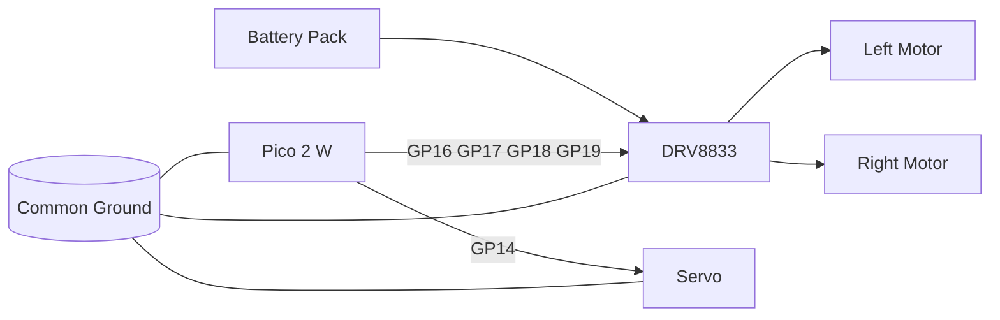
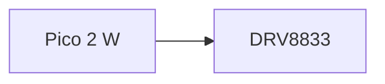

# Pico 2 W Robot Car

A compact Wi‑Fi robot car built from reused **ELEGOO Smart Robot Car Kit V4.0** chassis parts and new control electronics: a **Raspberry Pi Pico 2 W** and a **DRV8833** motor driver. This build reuses the ELEGOO base, motors, wheels, battery hardware, and chassis while replacing the original controller board.[cite:470][cite:456][cite:473]

## Parts

- ELEGOO Smart Robot Car Kit V4.0 chassis, motors, wheels, and battery hardware.[cite:470][cite:473]
- Raspberry Pi Pico 2 W.[cite:644][cite:646]
- DRV8833 motor driver.[cite:642]
- Jumper wires and breadboard / protoboard.
- Optional servo on GP14 with separate 5 V power and common ground.[cite:609][cite:611]

## Wiring

| Function | Pico pin | Connects to |
|---|---|---|
| Left motor IN1 | GP16 | DRV8833 input 1 |
| Left motor IN2 | GP17 | DRV8833 input 2 |
| Right motor IN1 | GP18 | DRV8833 input 3 |
| Right motor IN2 | GP19 | DRV8833 input 4 |
| Servo signal | GP14 | Servo signal wire |
| Ground | GND | DRV8833 GND and servo GND |

### Rules

- Battery positive goes to the DRV8833 motor supply, not to the Pico.[cite:642]
- Pico ground, DRV8833 ground, and servo ground must be common.[cite:639][cite:642]
- Servo power should come from a stable 5 V source; the Pico provides only the signal line.[cite:609][cite:611]

## Diagram



## Software

- `firmware/CarPico4/CarPico4.ino` for the Pico.
- `controller/nes_controller.py` for the PC controller.
- Pico runs as a Wi‑Fi AP and accepts UDP commands such as `F`, `B`, `L`, `R`, `X`, and `S`.[cite:481][cite:486]

## Build notes

1. Assemble the ELEGOO chassis and battery hardware.[cite:456][cite:473]
2. Mount the Pico 2 W and DRV8833 on the top deck.
3. Wire the motors to the DRV8833.
4. Wire GP16–GP19 from the Pico to the DRV8833.
5. Tie all grounds together.
6. Add the optional servo on GP14 with separate 5 V power.[cite:609][cite:611]

## Photos to include

Put your pictures in `docs/images/` and reference them from the README using relative paths. Good photos to include:

- Finished robot
- Top-down wiring view
- Bottom chassis view
- Pico close-up
- DRV8833 close-up
- Servo wiring close-up
- Battery path photo

## GitHub formatting

To keep the formatting on GitHub:

- Save the file as **`README.md`** in the root of the repo.[cite:667]
- Keep diagrams inside fenced code blocks labeled `mermaid`; GitHub renders Mermaid directly in README files.[cite:653][cite:654]
- Store images inside the repo, for example `docs/images/top-view.jpg`, and link them with relative paths so they stay with the project.[cite:664][cite:667]
- Standard Markdown tables, headings, bullet lists, code blocks, and inline HTML all render in GitHub README files.[cite:667]
- GitHub itself renders Mermaid in repository Markdown, but GitHub Pages may need extra setup depending on your Pages stack.[cite:657][cite:659]

### Example image syntax

```md

```

### Example Mermaid syntax

```md

```
